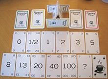

# Planning Poker  

Il est très difficile d’estimer le temps de travail que demande la réalisation d’une tâche. Cela reste vrai quand on a des années d’expérience, ça l’est donc encore plus quand on n’en a pas.  
On va donc accepter notre inaptitude à chiffrer en heures et se contenter de comparer des tâches entre elles, par exemple : « J’estime que cette tâche va me prendre environ quatre fois plus de temps que celle-ci ».  
Le planning poker est une façon ludique de produire des estimations sur l'effort nécessaire à la réalisation de tâches.

L'avantage principal du planning poker est de permettre à tous de s'exprimer librement. L'estimation serait meilleure parce que plusieurs personnes l'auront validée : des participants avec des niveaux d'expérience et d'expertise différents. De plus, cette technique favorise les échanges entre le responsable de produits et l'équipe de développement.

L'estimation se fait en points et non en temps.

Les points permettent d'obtenir une mesure relative de l'effort car les scénarios sont comparés entre eux. L'équivalent en temps est propre à chacun, selon ses compétences, son expérience et sa connaissance du domaine. L'avantage d'utiliser des points réside surtout dans le fait que l'échelle utilisée restera stable tout au long du projet. Peu importe la vitesse (vélocité) à laquelle l'équipe de développement accomplira ces tâches, nul besoin de réviser les estimations : c'est le rapport entre le temps réel et les points qui évoluera.

La suite de Fibonacci est utilisée pour les évaluations. Comme nous cherchons un dimensionnement de l'effort, le message est clair : plus le scénario est gros, moins l'évaluation est précise. Le paquet de cartes utilisé pour le planning poker doit donc comporter les valeurs suivantes : 1, 2, 3, 5, 8, 13, 21, 34, 55, 89, 144. Certains simplifient les grandes valeurs en les transformant en 20, 40, 100... puisqu'il s'agit d'être globalement bon plutôt que précisément erroné. On y ajoute généralement les valeurs 0 et 1/2.

Il est préconisé de se mettre d'accord sur un scénario de référence, traditionnellement équivalent à la valeur 1 (ou 2).

Déroulement :
1.	Les participants s'installent autour d'une table, placés de façon que tout le monde puisse se voir.
2.	Le PO présente à l'équipe une user story.
3.	Les participants posent des questions au PO, discutent du périmètre du scénario, évoquent la DoD et les tests d’acceptation.
4.	Chacun des participants évalue l'effort de développement de ce scénario, choisit la carte qui correspond à son estimation et la dépose, face vers le bas, sur la table devant lui.
5.	Au signal du facilitateur, les cartes sont retournées en même temps.
6.	S'il n'y a pas unanimité, la discussion reprend.
7.	On répète le processus d'estimation jusqu'à l'obtention de l'unanimité.

Une procédure optimisée consiste, après la première "donne", à demander aux deux acteurs ayant produit les évaluations extrêmes d'expliquer leurs points de vue respectifs. Ces explications achevées et comprises de tous, une nouvelle estimation est produite et c'est alors la moyenne arithmétique de ces estimations qui est prise en compte.

_(Basé sur le contenu [Wikipedia](https://fr.wikipedia.org/wiki/Planning_poker))_